# Revit to Autocad by Shared Coordinates

## Scope

The goal of this tool is to export a sheet from Revit to dwg and set its plan viewports UCS to world coordinates. 

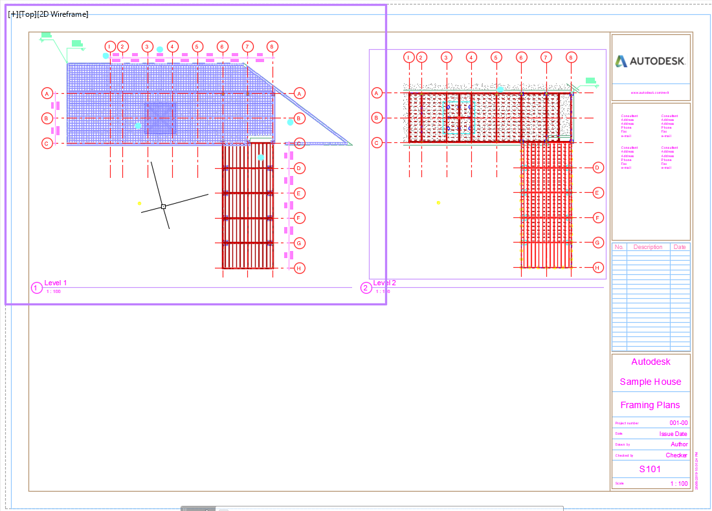

In doing this, the coordinates of a point inside the viewport will match the shared coordinates of the same point in Revit:

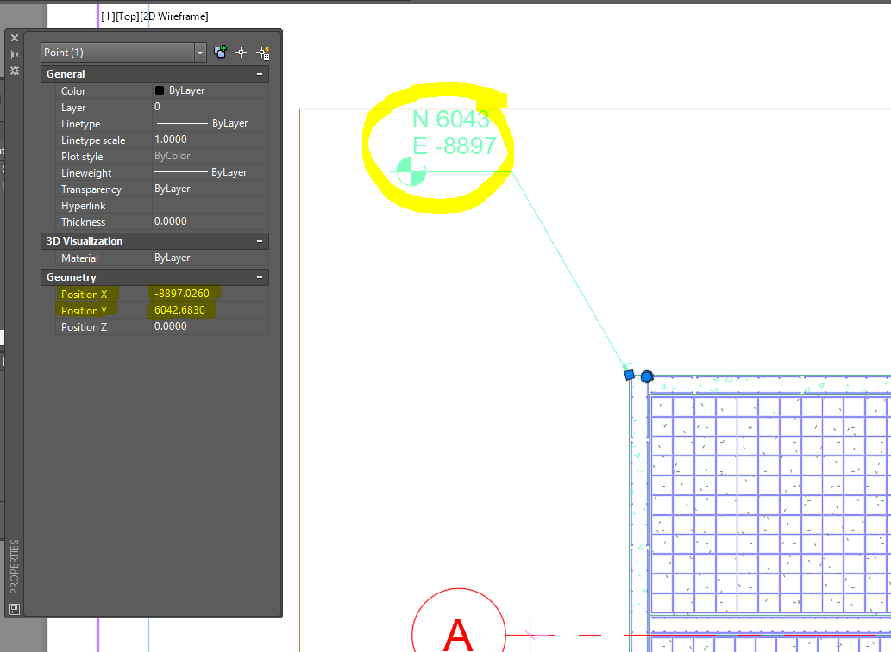

When a sheet is exported from Revit, its viewports are placed close to the origin neither in shared or project base coordinates:

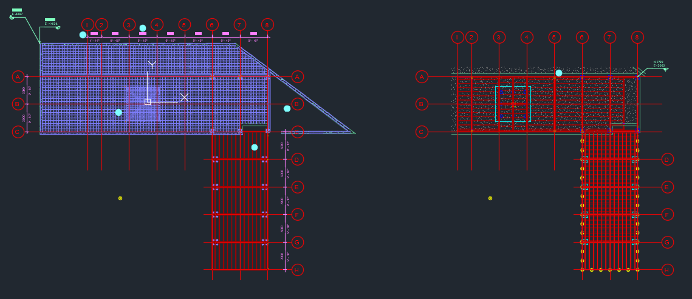

## Workflow

1. Export the sheet from Revit without the plan views. If Viewports do not contain plan views, they can be left unchanged. Their content will be exported by Revit in the traditional way (positioned close the dwg origin). In some cases hiding the content of the viewport will affect keynotes placed on the sheets. To address this, an additional workflow has been developed to export the sheets from Revit in the traditional way and to delete the viewport's content (if it's a plan) in Autocad.

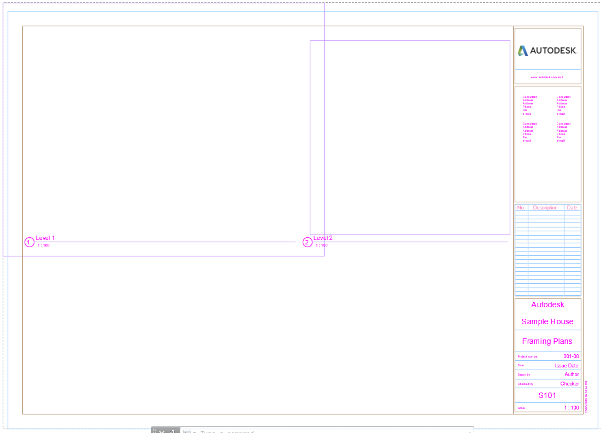

2. Export the viewports plan views in shared coordinates and import them in Autocad. If they do not overlap we can bind them, otherwise we can place them on different layers and control their visibility from the viewport layer manager. 

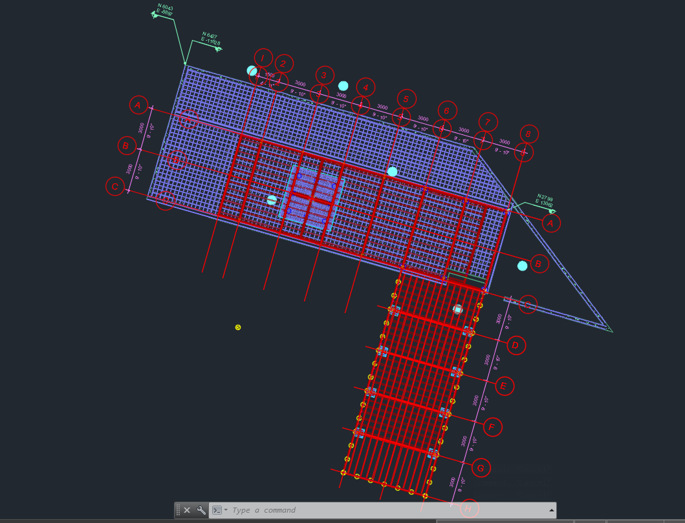

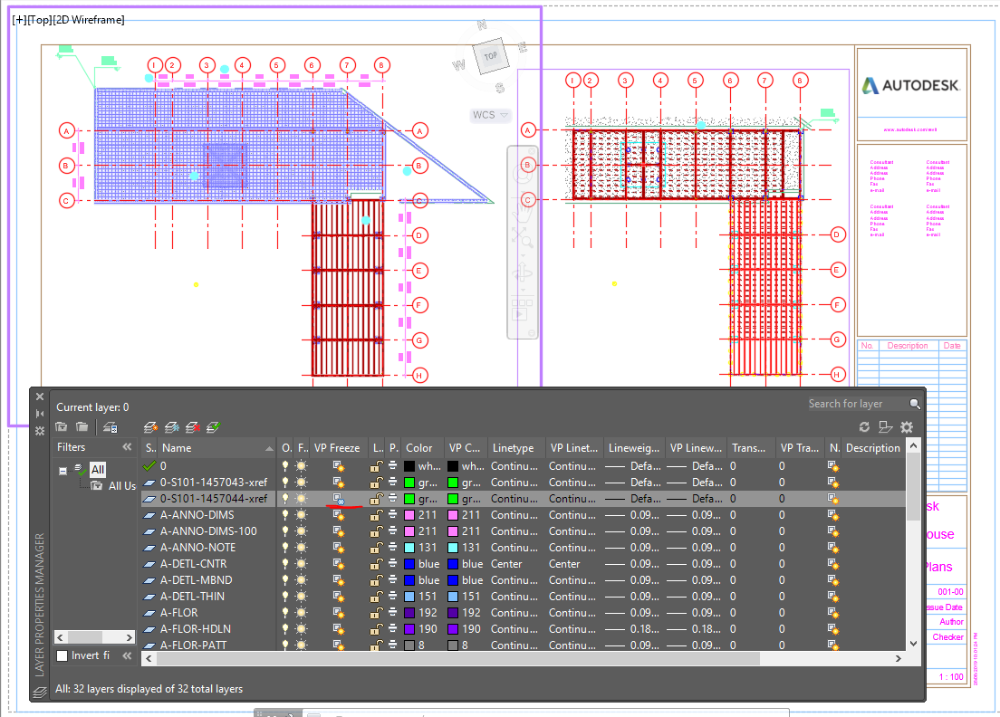

Overlapping plans could also be placed at different Z levels and the visibility controlled by a clip boundary but the clip boundary does not work with text:

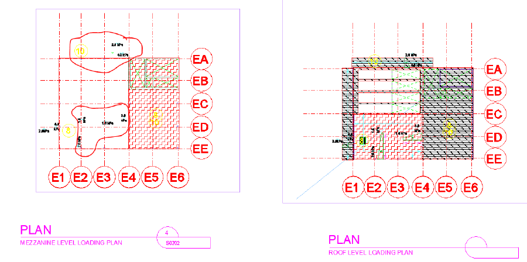

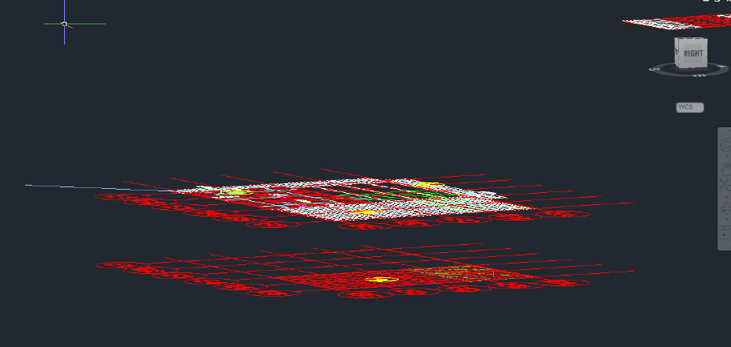

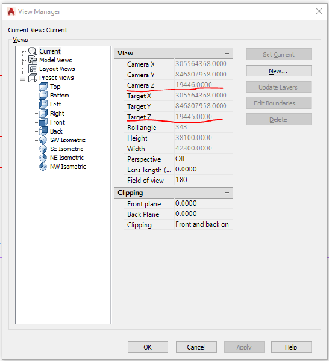

3. Move the viewport center to match the center of each plan and rotate the view by the Angle to True North so it looks like what's on the Revit sheet.

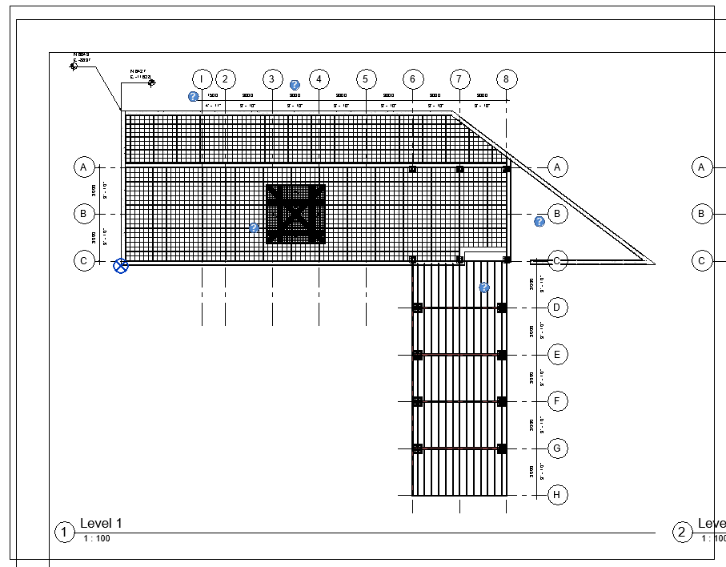

## Addins

### Revit

The tool comprises two addins: one for Revit and one for Autocad. 
The Revit addin will add a new tab ("Mx CADD Export") with 4 buttons and an Help task dialog. Buttons are meant to be run in order from left to right.

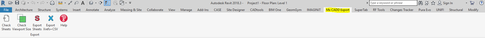

*Check Sheets*: checks if there are plan views on a sheet and if they are overlapping or not. It will also check if keynotes are placed on the sheet. It will exports a csv file summary. 
Sheets must have a parameter called "Mx Export_Sheet Filter" which will be populated once the command has run. There are 5 possible outputs: *No Plans*, *Plans Not Overlapping*, *Plans Overlapping*. Suffix *-Keynote* will be added if there are keynotes placed on the sheet.
Views must have a parameter called "Mx Keyplan (Y as required)". If the parameter is set to Y, the viewport will not be exported as xref later. 

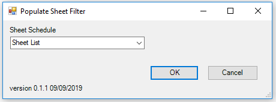

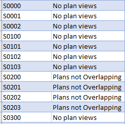

*Check Viewport Size*: checks that the viewports on a sheet are within the titleblock boundaries. It will exports a csv file summary.

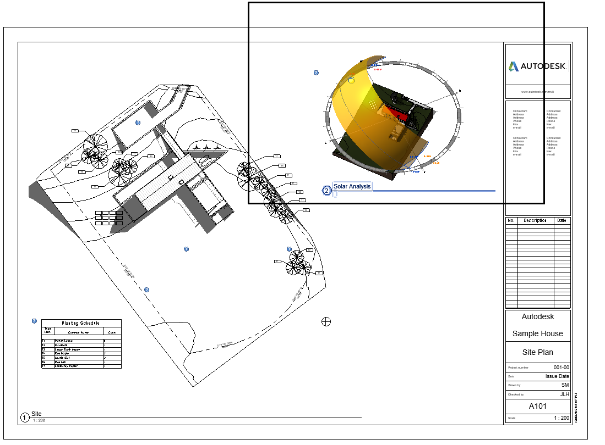

*Export Sheets*: exports the selected sheets to dwg. Export settings should be: Units: mm, Shared Coordinates (not meaningful in this case), No Xrefs. Before exporting, the user can decide to hide all the content of Floor, Ceiling, Area and Engineering plans. Please note that if a keynote is present on a sheet, its content will be hidden too. For output see Workflow step 1.

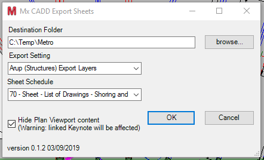

*Export Xrefs + CSV*: same principle as Export Sheets but working on plan views only. For each selected sheet, it loops through its viewports and if a viewport is a Floor, Ceiling, Area or Engineering plan it exports it (in mm, by shared coordinates, no xrefs).

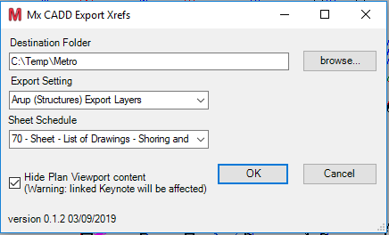

It also calculates: 

- the center point on the sheet of each viewport
- the corresponding point in Shared Coordinates
- the Angle to the True North
- the viewport width and height

and stores these information in a csv file along with sheet number, plan view name and sheet group (xref or bind).

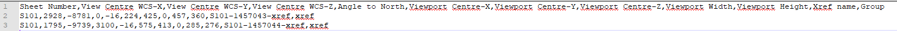

### Autocad

The Autocad addin has to be loaded ("NETLOAD") and  launched ("Merge" or "MergeAndBind") through the command line (solution MxAutocadCommands).

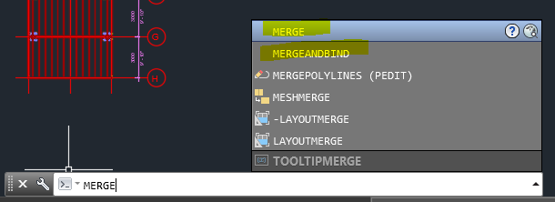

Both commands read the csv file and:

- open a dwg sheet file
- import the xref
- locate the corresponding viewport on the paper space and transform its UCS
- hide the xref in all the other viewports on the sheet
- bind or leave it as xref
- purge, audit and save the file

Note: the script could be improved by loading all the xref on a sheet at the same time. At the moment the script load the xref one by one, each time opening and closing the sheet file.

This addin has been replaced by a .bat file which call a .scr file on all the dwgs inside the same folder without opening an Autocad instance. The scripts uses accoreconsole and its commands are saved in the MxAutocadBatchCommands solution. 

    FOR /F %%f IN ('dir /b /s "*.dwg"^|find /i /v "xref"') DO  
    "C:\Program Files\Autodesk\AutoCAD 2019\accoreconsole.exe" /i "%%f" 
    /s "%~dp0runNotOverlapping.scr" /l en-US
    pause

## Desktop App

Instead of running the .bat files manually, they can be called by a button in a desktop app:

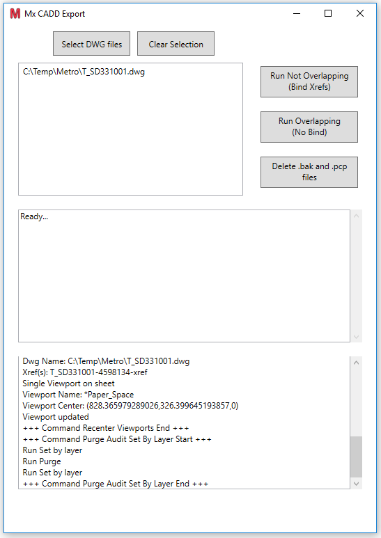

The desktop app can be used with Autocad accoreconsole to launch a script (which should be saved in the same folder):

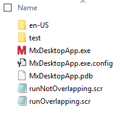

    // runNotOverlapping.scr (bind the xrefs)
    NETLOAD "C:\Program Files\Autodesk\AutoCAD 2019\MxAutocaBatchCommands.DLL"
    attdia 0
    cmddia 0
    filedia 0
    dwgcheck 0
    DELETEVP
    LOADANDBINDXREFS //bind xref
    RECENTERVIEWPORTS
    PURGEAUDITSET
    attdia 1
    cmddia 1
    filedia 1
    dwgcheck 1
    qsave
    
    // runOverlapping.scr (do not bind the xrefs)
    NETLOAD "C:\Program Files\Autodesk\AutoCAD 2019\MxAutocaBatchCommands.DLL"
    attdia 0
    cmddia 0
    filedia 0
    dwgcheck 0
    DELETEVP
    CREATELAYERS
    LOADXREFS //do not bind xref
    RECENTERVIEWPORTS
    PURGEAUDITSET
    attdia 1
    cmddia 1
    filedia 1
    dwgcheck 1
    qsave