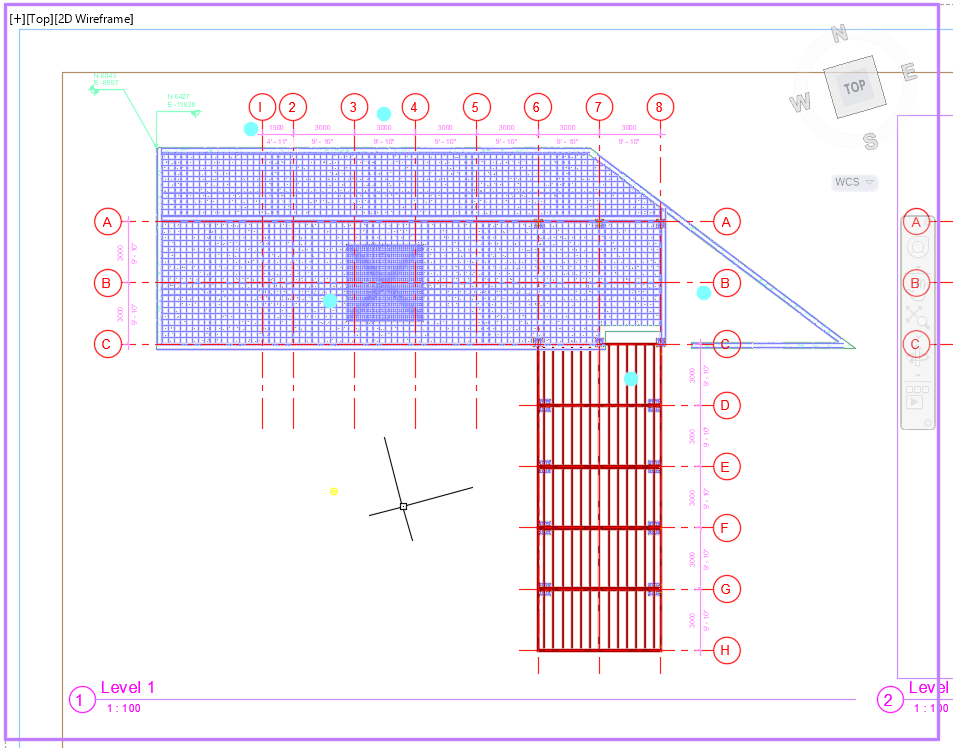

# Autocad Set Viewport

Last Edited: Aug 26, 2019 11:09 PM

## Scope

The goal of this tool is to set export a sheet from Revit to dwg and set its plan viewports UCS to world coordinates. 

In doing this, the coordinates of a point inside the viewport will match the shared coordinates of the same point in Revit:

When a sheet is exported from Revit, its viewports are placed close to the origin neither in shared or project base coordinates:

## Workflow

1. Export the sheet from Revit without the plan views

2. Export the viewports plan views in shared coordinates and import them in the sheet dwg file. If they do not overlap we can bind them, otherwise we can place them on different layers and control their visibility from the viewport layer manager. 

Overlapping plans could also be placed at different Z levels and the visibility controlled by a clip boundary but the clip boundary does not work with text:

3. Move the viewport center to match the center of each plan and rotate the view by the Angle to True North so it looks like what's on the Revit sheet.

## Addins

### Revit

The tool comprises two addins: one for Revit and one for Autocad. 
The Revit addin will add a new tab with 4 buttons 

*Check Sheets*: checks if there are plan views on a sheet and if they are overlapping or not. It exports a csv file summary.

*Check Viewport Size*: checks that the viewports on a sheet are within the titleblock boundaries. It exports a csv file summary.

*Export Sheets*: exports the selected sheets to dwg (mm, shared coordinates (not meaningful), no xrefs). Before exporting, it hides all the content of Floor, Ceiling, Area and Engineering plans. (BUG: if a keynote is present on a sheet, the content get hidden too). For output see Workflow step 1.

*Export Xrefs + CSV*: same principle as Export Sheets but working on plan views only. For each selected sheet, loop through its viewports and if a viewport is a Floor, Ceiling, Area or Engineering plan it export it (in mm, shared coordinates, no xrefs).

It also calculates: 

- the center point on the sheet of each viewport
- the corresponding point in Shared Coordinates
- the Angle to the True North
- the viewport width and height

and stores these information in a csv file along with sheet number, plan view name and sheet group (no plans, plans overlapping or not. No plans and plans not overlapping xrefs can be bound, while plan overlapping xrefs will not be bound).

### Autocad

The Autocad addin has to be loaded ("NETLOAD") and  launched ("Merge" or "MergeAndBind") through the command line.

Both commands read the csv file and:

- open a dwg sheet file
- import the xref
- locate the corresponding viewport on the paper space and transform its UCS
- hide the xref in all the other viewports on the sheet
- bind or leave it as xref
- purge, audit and save the file

Note: the script could be improved by loading all the xref on a sheet at the same time. At the moment the script load the xref one by one, each time opening and closing the sheet file.

### Problems encountered:

1. Convert the Viewport center coordinates on a sheet to Project Base Point (and then Survey Point) coordinates.

    Solution: Find the Viewport's view center point which is in PBP coordinates.

2. The Viewport center does not always match the View center. Annotations, Matchlines and Grids can affect the extent of the viewport (hence the position of its center point).
Solution: hide all these categories and find the Viewport center that matches the View center. Then find the View center point in PBP coordinates and translate it by the vector from Viewport original center and the center of the Viewport with the categories hidden.
See https://thebuildingcoder.typepad.com/blog/2018/03/boston-forge-accelerator-and-aligning-plan-views.html